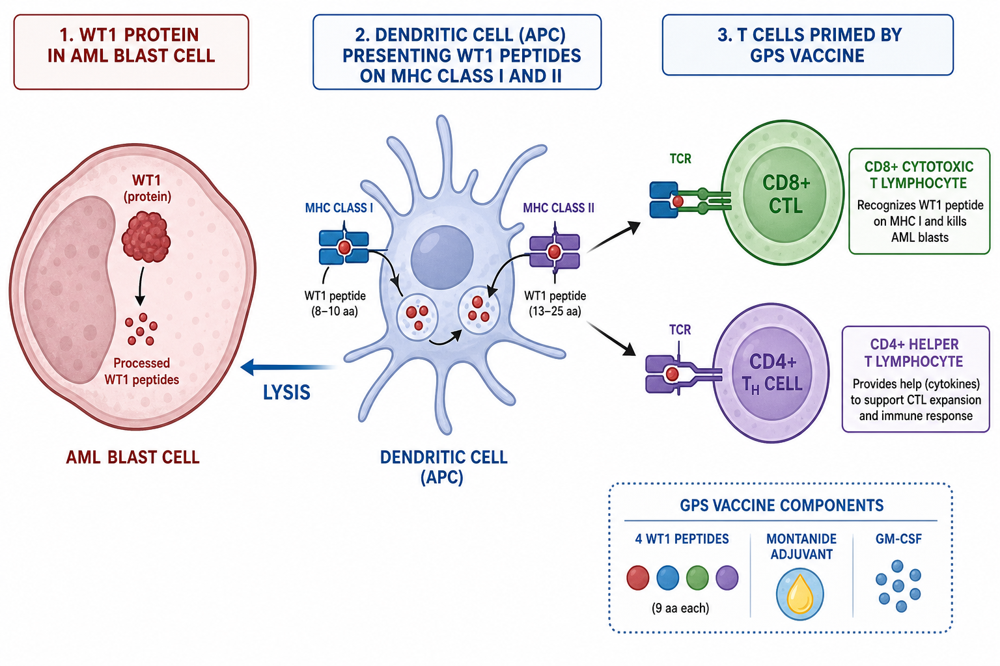
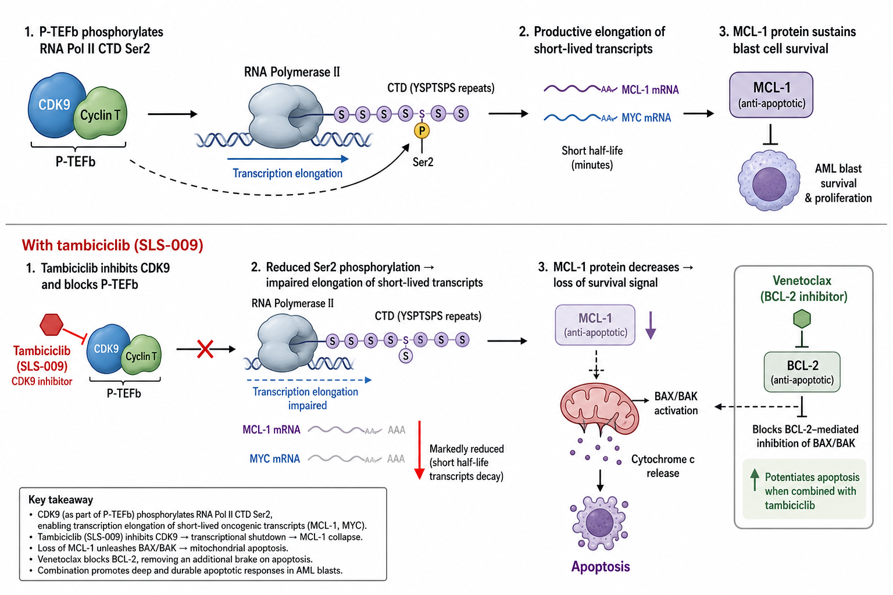
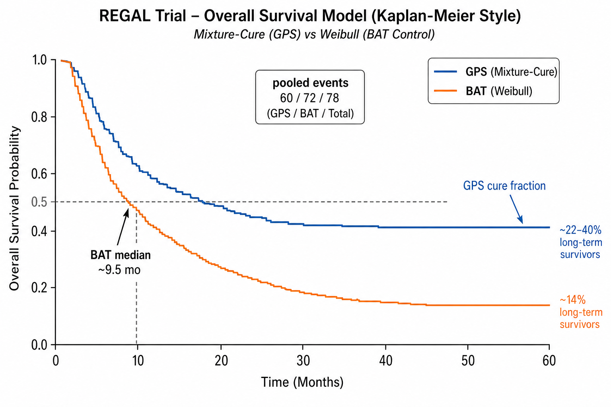
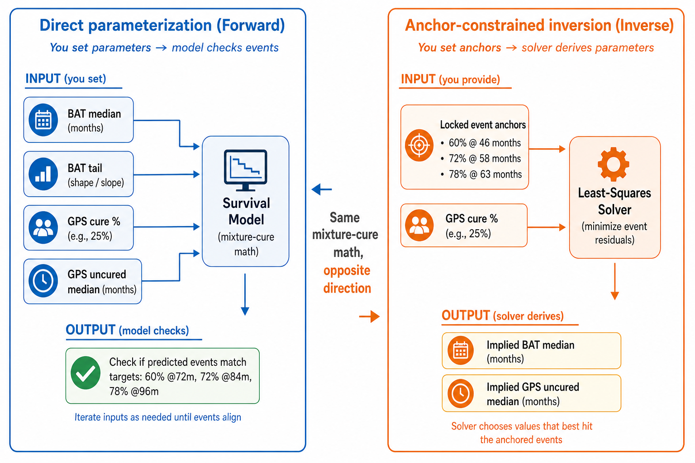
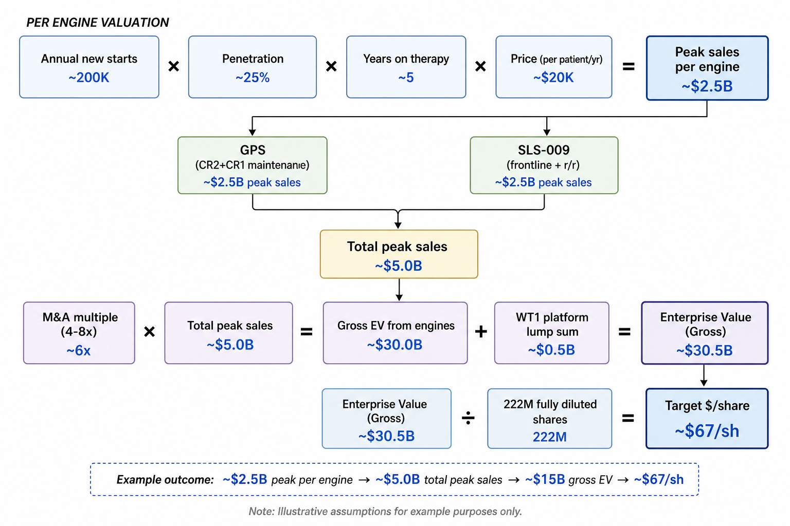

# SELLAS Life Sciences ($SLS) — NotebookLM Source Pack

**Purpose:** Primary-sourced educational material for informational videos about SELLAS's pipeline, the open-source [SLS-Model](https://sls-model.vercel.app) interactive explorer, and the science behind REGAL (GPS), SLS-009 (tambiciclib), and valuation scenarios.

**Disclaimer:** Educational and analytical only — not investment, medical, legal, or financial advice. The REGAL trial remains **blinded**; nothing here predicts the outcome. Tags used throughout: **✅ Verified fact** (primary source) · **🔬 Model output** (computed in SLS-Model) · **⚠️ Assumption** (adjustable slider / community theory) · **❓ Unknown** (not disclosed).

---

## Executive Summary

SELLAS Life Sciences is a clinical-stage biotech with **two mechanistically unrelated AML programs**:

1. **GPS (galinpepimut-S)** — a WT1-directed peptide cancer vaccine in the pivotal Phase 3 **REGAL** trial ([NCT04229979](https://clinicaltrials.gov/study/NCT04229979)). The trial is **event-driven**: it ends after **80 deaths**. As of **11 May 2026**, SELLAS reported **78 pooled deaths** (both arms combined, blinded) and the trial continues ([Q1 2026 PR](https://www.globenewswire.com/news-release/2026/05/12/3293399/0/en/sellas-life-sciences-reports-first-quarter-2026-financial-results-and-provides-corporate-update.html)).

2. **SLS-009 (tambiciclib)** — a selective **CDK9 inhibitor** in an open-label **single-arm** Phase 2 with azacitidine + venetoclax for post-venetoclax relapsed/refractory AML-MR ([NCT05309745](https://clinicaltrials.gov/study/NCT05309745)). ASH 2025 data: **ORR 46%**, **mOS 8.9 months** in least-pretreated patients vs **~2.5–2.6 months** historical benchmark ([ASH 2025 IR](https://ir.sellaslifesciences.com/news/News-Details/2025/SELLAS-Life-Sciences-Presents-Positive-Phase-2-Data-of-SLS009-in-Combination-with-AZAVEN-in-RelapsedRefractory-AML-MR-at-ASH-2025/default.aspx)).

The **SLS-Model** web app translates these facts into adjustable survival curves, hazard-ratio estimates, Monte Carlo **P(win)** posteriors, and back-of-envelope valuation — with every verified number locked to its source and every slider labeled as an undisclosed assumption.

**Suggested video chapters (6 segments, ~2–4 min each):**
1. Biology: WT1 → GPS vaccine → CTL mechanism
2. Biology: CDK9/P-TEFb → MCL-1/MYC → apoptosis + venetoclax combo
3. REGAL trial design + event anchors (60/72/78)
4. Forward vs inverse modeling + P(win) + identifiability ridge
5. SLS-009 Phase 2 data, benchmarks, limitations
6. WT1 platform + EV valuation + buyout scenarios

---

## Part 1 — Biology

### 1.1 WT1: The #1-Ranked Cancer Antigen

**WT1** (Wilms' tumor 1) is a zinc-finger transcription factor normally silenced in healthy adult tissue but **overexpressed in most AML and MDS blasts**. ✅ In 2009, an NCI working group ranked **75 cancer antigens** and placed **WT1 at #1** for cancer immunotherapy priority ([Cheever et al., *Clin Cancer Res* 2009](https://pubmed.ncbi.nlm.nih.gov/19723653/)).

Even though WT1 is intracellular, proteasomal fragments are presented on MHC class I and II — allowing CD8⁺ cytotoxic T lymphocytes (CTLs) to recognize WT1⁺ blasts from outside. This is textbook antigen-presentation biology; GPS exploits it as a **maintenance immunotherapy** in second complete remission (CR2), not for debulking active disease.

**Sources:** [Cheever 2009](https://pubmed.ncbi.nlm.nih.gov/19723653/) · [SELLAS science page](https://sellaslifesciences.com/science/) · [Jamy & Cicic 2025 REGAL design review (PMC11760237)](https://pmc.ncbi.nlm.nih.gov/articles/PMC11760237/)



### 1.2 GPS (galinpepimut-S): WT1 Peptide Vaccine

**GPS** is a mixture of **four WT1-derived peptides**: two **heteroclitic** (single amino-acid mutations to break immune tolerance) and two native peptides, covering CD8⁺ (MHC I) and CD4⁺ (MHC II) responses across HLA types. ✅ Peptides are administered with **Montanide** adjuvant and **GM-CSF** pre-dosing to recruit antigen-presenting cells ([Jamy & Cicic 2025](https://pmc.ncbi.nlm.nih.gov/articles/PMC11760237/)).

**Intended mechanism (⚠️ theoretical MOA, not yet proven at Phase 3 scale):** APCs present WT1 peptides → CD4⁺ help + CD8⁺ CTL priming → CTLs lyse WT1⁺ minimal residual disease blasts → prolonged remission.

**Phase 2 evidence (company-reported, small n):**
- **CR2 cohort (Brayer 2015, n=10):** GPS mOS **16.3 vs 5.4 months** (p=.02); **no survival plateau** observed ([PubMed](https://pubmed.ncbi.nlm.nih.gov/?term=Brayer+WT1+vaccination+AML+MDS+pilot+synthetic+analog+peptides))
- **CR1 cohort:** ~**47% 3-year plateau**; immune-response rate ~64% ([design paper PMC11760237](https://pmc.ncbi.nlm.nih.gov/articles/PMC11760237/))

GPS is licensed from Memorial Sloan Kettering; composition-of-matter patent extends to **≥2033** ([Q1 2026 PR](https://www.globenewswire.com/news-release/2026/05/12/3293399/0/en/sellas-life-sciences-reports-first-quarter-2026-financial-results-and-provides-corporate-update.html)).

### 1.3 CDK9 / P-TEFb: The Transcription Switch

**CDK9** is the catalytic subunit of **P-TEFb** (CDK9 + cyclin T). Its job is phosphorylating **Ser2** on the RNA polymerase II C-terminal domain, releasing paused polymerase into productive **transcriptional elongation**. ✅ Established textbook mechanism ([Anshabo et al. 2021, PMC8143439](https://pmc.ncbi.nlm.nih.gov/articles/PMC8143439/); [Fu et al. 2021](https://pmc.ncbi.nlm.nih.gov/articles/PMC8257543/)).

Cancer-relevant targets of this elongation machinery have **short-lived mRNAs and proteins** — especially **MCL-1** (anti-apoptotic BCL-2 family) and **MYC**. MCL-1 protein turns over in roughly **one hour**, so its level tracks ongoing transcription almost in real time. Shut off CDK9 → MCL-1 collapses within hours → apoptosis. ✅ ([Boffo et al. 2018](https://doi.org/10.1186/s13046-018-0704-8); [Bewersdorf & Zeidan 2019](https://www.frontiersin.org/journals/oncology/articles/10.3389/fonc.2019.01205/full))



### 1.4 SLS-009 (tambiciclib): Selective CDK9 Inhibitor + Venetoclax Rationale

**SLS-009** (tambiciclib; formerly GFH009) is a **selective CDK9 inhibitor** licensed from GenFleet ([SEC 8-K exhibit, Mar 2026](https://www.sec.gov/Archives/edgar/data/1390478/000139047826000004/sls-202603198xkexhibit991.htm)). ⚠️ **Theoretical MOA:** block CDK9 → suppress MCL-1/MYC transcription → apoptosis.

**Why combine with azacitidine + venetoclax (AZA/VEN)?** Venetoclax inhibits **BCL-2**, but leukemic cells commonly escape via **MCL-1 upregulation** — a documented venetoclax-resistance mechanism ([PMC8858957](https://pmc.ncbi.nlm.nih.gov/articles/PMC8858957/)). SLS-009 pulls MCL-1 **down** while venetoclax blocks BCL-2 — a **dual anti-apoptotic blockade** (⚠️ theoretical MOA for the combination).

**Honest framing:** GPS and SLS-009 share a sponsor only. **No human trial combines GPS + SLS-009.**

---

## Part 2 — REGAL Trial & SLS-Model

### 2.1 Trial Design Facts (✅ Verified)

| Parameter | Value | Source |
|-----------|-------|--------|
| Trial ID | [NCT04229979](https://clinicaltrials.gov/study/NCT04229979) | ClinicalTrials.gov |
| Population | AML in CR2/CRp2, transplant-ineligible at entry | NCT04229979 |
| Randomization | 1:1 GPS vs BAT (best available therapy) | NCT04229979 |
| N enrolled | **127** (105 ex-China by Nov 2023; full enrollment ~Apr 2024) | [Apr 2024 PR](https://www.globenewswire.com/news-release/2024/04/29/2871141/0/en/SELLAS-Life-Sciences-Announces-Positive-Recommendation-of-Independent-Data-Monitoring-Committee-Following-Completion-of-Enrollment-in-REGAL-Phase-3-Study.html) |
| Primary endpoint | Overall survival (ITT, death from any cause) | NCT04229979 |
| Event target | **80 deaths** | [Jamy & Cicic 2025](https://pmc.ncbi.nlm.nih.gov/articles/PMC11760237/) |
| Design HR alternative | **0.636** (~90% power at ~205 events; at 80 events this is the ~50% power **bar**, not the expected effect) | Jamy & Cicic 2025 |
| Interim look | 60 events; OBF efficacy boundary **HR ≤ 0.547** (Z=2.34) | Jamy & Cicic 2025 |
| Final win threshold | **HR < 0.636** (Z ≥ 2.01 at 80 events) | Jamy & Cicic 2025; `THRESH=0.636` in SLS-Model |
| Interim outcome (Jan 2025) | IDMC recommended **continue without modification** at 60 events | [Jan 2025 PR](https://www.globenewswire.com/news-release/2025/01/23/3014244/0/en/SELLAS-Life-Sciences-Announces-Positive-Outcome-of-Interim-Analysis-for-its-Pivotal-Phase-3-REGAL-Trial-of-GPS-in-Acute-Myeloid-Leukemia.html) |
| BAT options | Observation, azacitidine, venetoclax, low-dose cytarabine | NCT04229979 |
| Trial start | 8 Feb 2021 (month 0) | NCT04229979 |

**BAT historical anchors:** Kurosawa 2010 — 158 AML CR2 transplant-ineligible patients, **3-year OS 14%** overall ([Haematologica 2010](https://haematologica.org/article/view/5781)). Venetoclax-era salvage medians ~**8–12 months** ([Stahl, *Blood Adv* 2021](https://pubmed.ncbi.nlm.nih.gov/33661271/)).

### 2.2 Event Anchors (✅ Verified, Pooled & Blinded)

SELLAS reports **pooled** death counts — not which arm each death belongs to:

| Events | Trial month | Calendar date | Source |
|--------|-------------|---------------|--------|
| **60** | ~m46 | 23 Jan 2025 | [Jan 2025 interim PR](https://www.globenewswire.com/news-release/2025/01/23/3014244/0/en/SELLAS-Life-Sciences-Announces-Positive-Outcome-of-Interim-Analysis-for-its-Pivotal-Phase-3-REGAL-Trial-of-GPS-in-Acute-Myeloid-Leukemia.html) |
| **72** | ~m58 | 29 Dec 2025 | [Dec 2025 PR](https://www.globenewswire.com/news-release/2025/12/29/3210926/0/en/SELLAS-Life-Sciences-Provides-Update-on-Pivotal-Phase-3-REGAL-Trial-of-Galinpepimut-S-GPS-in-Acute-Myeloid-Leukemia-AML.html) |
| **78** | ~m63 | 11 May 2026 | [Q1 2026 PR](https://www.globenewswire.com/news-release/2026/05/12/3293399/0/en/sellas-life-sciences-reports-first-quarter-2026-financial-results-and-provides-corporate-update.html) |
| **80** | TBD | Not yet reached (Jul 2026) | Protocol |

✅ Nov 2022 blinded read: pooled mOS "**approximately two-fold longer** than originally anticipated" (design ~10.3 mo → ~20 mo) ([Nov 2022 PR](https://www.globenewswire.com/news-release/2022/11/14/2554907/0/en/SELLAS-Life-Sciences-Announces-Update-on-Phase-3-REGAL-Clinical-Trial-Evaluating-Lead-Asset-Galinpepimut-S-in-Acute-Myeloid-Leukemia.html)).

❓ **Unknown:** arm-level split of the 78 deaths; actual in-trial BAT median; stratified Cox HR from the SAP.

### 2.3 Mixture-Cure Survival Model (🔬 Model Output)

The SLS-Model draws Kaplan–Meier–style curves from enrollment through death:

**BAT arm (control):** Weibull decline (shape k=1 → exponential) + **long-survivor tail** fraction `batc`:
```
S_BAT(t) = batc + (1 − batc) · exp(−(t/λ)^k)
```

**GPS arm (treatment):** **Mixture-cure** model — fraction `gpsc` on permanent plateau + uncured exponential decline, with optional **onset delay**:
```
S_GPS(t) = gpsc + (1 − gpsc) · exp(−ln2 · (t − delay) / gpsu)   [after delay]
```

Both arms include optional **post-enrollment transplant ITT tail** (~6%/arm) and **censoring** (~12%). Expected deaths at month T = enrollment-weighted sum of `(1 − S(T − enroll))` per arm.



**Hazard ratio (HR):** Pike O–E ratio `(O/E)_GPS ÷ (O/E)_BAT` — an approximate log-rank HR, **not** the final SAP stratified Cox estimate.

**Significance:** Stratified log-rank Z-score; win = Z ≥ **2.01** (O'Brien-Fleming final boundary).

### 2.4 Direct (Forward) vs Anchor-Constrained (Inverse) Methods



**Direct parameterization (Forward):** You **set** BAT median, BAT tail %, GPS cure %, GPS uncured median, onset delay → model checks whether expected deaths match 60/72/78. HR and mOS are **outputs** you inspect.

**Anchor-constrained inversion (Inverse):** You **lock** event anchors (60/72/78) and set **GPS cure fraction** as the primary structural knob → least-squares solver **derives** implied BAT median, BAT tail, and GPS uncured median (BAT capped at 3-year OS ~14–18% per Kurosawa biology). HR and mOS fall out as derived outputs.

Both use the same mixture-cure machinery; only the **direction of fit** reverses. Community practitioner framing: u/Confident-Web-7118 ([Part 1 DD](https://www.reddit.com/r/ValueInvesting/comments/1ri8rrb/sls_deepest_due_diligence_for_regal_trial_from_a/)); critique: u/uhdisj41 ([identifiability thread](https://www.reddit.com/r/pennystocks/comments/1h8v0zv/critique_of_confident_webs_sls_dd/)). ⚠️ Community DD = adjustable scenarios, not established fact.

### 2.4.1 Best Available Guess Methodology (biology-first → inverse → forward verify)

The **Best Available Guess ★** preset is **not** a neutral literature anchor fit. It follows a three-step pipeline:

1. **Biology-first:** Fix GPS cure at **42%** — upper band of Phase 2/WT1 MOA-informed estimates (35–42%; CR1 ~47% 3-yr plateau is selection-biased; CR2 showed no plateau but ~64% immune-response rate supports a substantial cure fraction).
2. **Inverse solve:** Run `inverseSolve` with **cw42** settings (42% cure, 3-mo onset delay, BAT 3-yr OS cap **14%** per Kurosawa transplant-ineligible CR2) → implied BAT median **13.0 mo**, BAT tail **0%**, GPS uncured mOS **54.1 mo**.
3. **Forward verify:** Copy solver output into the forward `best` preset sliders; confirm `passesVerdict` on 60/72/78 anchors and readout HR **~0.25** (well below 0.636 win threshold, unlike the old ~0.47 neutral fit).

This aligns forward and inverse default scenarios: clicking **Best Available Guess** or inverse **GPS 42% cure (CW inverse)** should show the same survival parameters and HR readout.

### 2.5 CW DD Stress-Test Presets (🔬 Model Output)

Each precanned scenario is a deliberate **Confident Web DD-style stress test** — one specific issue from u/Confident-Web-7118 or u/uhdisj41 critique, not arbitrary slider positions. All anchor-fitting presets **fit** 60/72/78 within tolerance (`npm test` preset regression).

| Preset | CW stress test | Mode | GPS cure | BAT tail | HR @ m58 | Fits anchors? |
|--------|----------------|------|----------|----------|----------|---------------|
| **Best Available Guess ★** | Biology-first → inverse → forward verify | forward | **42%** | **0%** | **0.254** | Yes |
| Binding IA (~50%) | Interim binding cap / registrational IA | forward | 42% | 0% | 0.254 | Yes |
| Non-binding IA (~78%) | Non-binding interim upper bound | forward | 42% | 0% | 0.254 | Yes |
| BAT tail holds survivors | Heterogeneous BAT long-tail near-miss | forward | 14% | 16% | **0.550** | Yes |
| Bull: strong GPS cure | Optimistic cure / low BAT tail | forward | 40% | 6% | **0.174** | Yes |
| Critique: ~⅔ coin flip | uhdisj41 moderate GPS (~66% P(win)) | forward | 18% | 16% | 0.468 | Yes |
| CW published point (~85%) | CW Part 1 forward parameters | forward | 41% | 6% | **0.183** | Yes |
| Implausible BAT cap (stress) | Biology cap breach (BAT 3-yr OS ~70%) | forward | 12% | 20% | **0.644** | Yes (events); HR miss |
| Ridge: null effect fits anchors | Identifiability ridge HR ≈ 1 | forward | 28% | 28% | **1.000** | Yes (by design) |

**Inverse anchor-locked** (GPS cure fixed → derived medians):

| Preset | CW stress test | GPS cure | Implied BAT mOS | Implied GPS uncured | HR @ m58 |
|--------|----------------|----------|-----------------|---------------------|----------|
| GPS 42% cure (CW inverse) | CW bullish cure anchor | 42% | 13.0 mo | 54.1 mo | **0.254** |
| GPS 35% cure (conservative) | Conservative cure sweep | 35% | 11.8 mo | 54.8 mo | 0.233 |
| GPS 50% cure (high sweep) | High cure sweep | 50% | 13.8 mo | 47.8 mo | 0.288 |
| 42% cure + binding IA | Binding interim on inverse fit | 42% | 13.0 mo | 54.1 mo | 0.254 |

**Interim HR vs readout HR — two different bars:**
- **Interim efficacy floor @ m46 (60 events):** HR must be **≤ 0.547** to stop early for efficacy (REGAL did **not** stop) ✅
- **Final win threshold @ 80 events:** HR must be **< 0.636** to win
- **Best Available Guess model-implied interim HR @ m46: ~0.29** — well below the 0.547 floor (consistent with IDMC "continue") 🔬
- **Readout HR ~0.25** (m58 HR ~0.25) — materially below the old neutral-anchor ~0.47 fit; reflects biology-first 42% cure + anchor-locked inversion 🔬

### 2.6 Monte Carlo P(win) Methodology (🔬 Model Output)

1. Sample prior uncertainty on each slider (center = preset value, 1σ band = spread)
2. Weight each draw by **Poisson likelihood** of event increments: 60 @ m46, +12 to m58, +6 to m63, P(Δ≤1) @ m65
3. If **binding interim:** soft-weight P(continue) via OBF; score win via **conditional power** with Brownian correlation ρ = √(60/80)
4. **P(win)** = fraction of posterior weight with Z ≥ 2.01

**Binding vs non-binding interim materially shifts P(win):** ~50% vs ~78% under identical survival priors — because the SAP's exact binding status is not fully public, the app lets you toggle this assumption.

Methods: Lan-DeMets O'Brien-Fleming ([PubMed](https://pubmed.ncbi.nlm.nih.gov/6350825/)); conditional power ([Proschan & Hunsberger 1995](https://pubmed.ncbi.nlm.nih.gov/7786985/)); ABC likelihood-weighting ([Beaumont 2002](https://pubmed.ncbi.nlm.nih.gov/12082107/)).

### 2.7 Identifiability Ridge (Critical Honesty Section)

**The central statistical problem:** Public data are **pooled** death counts. The map `(S_GPS, S_BAT) → N_deaths` is **many-to-one**. Arm-level HR is **not identifiable** without the arm split or strong structural assumptions.

**Demonstration:** The "Ridge: null effect fits anchors" preset fits 60/72/78 with **HR ≈ 1.0** — assigning ~28% long-survivor tail to **both** arms equally. 🔬

**GPS-cure ↔ BAT-heterogeneity ridge:** A high GPS cure fraction with a weak BAT tail can produce the same pooled event trajectory as a modest GPS benefit with a strong BAT long-tail. Community DD debate ([CW vs u/uhdisj41](https://www.reddit.com/r/pennystocks/comments/1h8v0zv/critique_of_confident_webs_sls_dd/)) centers on this ridge.

**What the event pace does and does not prove:**
- ✅ 78 events with decelerating pace implies pooled survival **well above** historical CR2 medians
- ⚠️ A real benefit is **more likely than not** but **not established** pre-unblinding
- ❓ Magnitude of HR and arm split remain **model-dependent**

---

## Part 3 — SLS-009 (tambiciclib)

### 3.1 Trial Facts (✅ Verified)

| Parameter | Value | Source |
|-----------|-------|--------|
| Trial ID | [NCT05309745](https://clinicaltrials.gov/study/NCT05309745) | ClinicalTrials.gov |
| Design | Phase 2, **open-label, single-arm** | NCT05309745 |
| Regimen | SLS-009 + azacitidine + venetoclax | NCT05309745 |
| Population | r/r AML-MR after prior venetoclax; 87% AML-MR, 43% ASXL1-mut | [Jul 2025 PR](https://www.globenewswire.com/news-release/2025/07/15/3115485/0/en/SELLAS-Meets-All-Primary-Endpoints-in-Phase-2-Trial-of-SLS009-in-r-r-AML-and-Receives-FDA-Guidance-to-Advance-into-First-Line-Therapy-Study.html) |
| Evaluable (ASH 2025) | **n=35** (54 evaluable in Jul PR) | [ASH 2025 IR](https://ir.sellaslifesciences.com/news/News-Details/2025/SELLAS-Life-Sciences-Presents-Positive-Phase-2-Data-of-SLS009-in-Combination-with-AZAVEN-in-RelapsedRefractory-AML-MR-at-ASH-2025/default.aspx) |
| Optimal dose | **30 mg IV twice-weekly** + AZA/VEN | Jul 2025 PR |
| ORR | **46%** (CR+CRi+MLFS); **29% CR/CRi** | [Blood 2025 abstract](https://ashpublications.org/blood/article/146/Supplement%201/3423/552036/) |
| mOS | **8.9 mo** (least pretreated); NR in 1-prior-line subset | ASH 2025 IR |
| Historical benchmark | **~2.4–2.6 mo** (company-cited) | [Zainaldin 2022](https://doi.org/10.1080/10428194.2022.2113530) |
| FDA guidance | Advance to newly diagnosed + early ven resistance cohorts | Jul 2025 PR |
| Frontline Ph2 | First patient **Mar 2026**; ~80 pts randomized | [Mar 2026 IR](https://ir.sellaslifesciences.com/news/News-Details/2026/SELLAS-Life-Sciences-Announces-Enrollment-of-First-Patient-in-Newly-Diagnosed-First-Line-AML-Trial-of-SLS009/default.aspx) |

### 3.2 Model Scenarios (🔬 Model Output)

Under exponential survival assumption: **OS fold** = arm mOS ÷ benchmark mOS; **OS ratio** (≈ HR) = benchmark ÷ arm.

| Preset | Arm mOS | Benchmark mOS | OS fold | OS ratio (≈HR) | ORR |
|--------|---------|---------------|---------|----------------|-----|
| **Observed (Ph2)** | 8.9 mo | 2.5 mo | 3.6× | 0.28 | 46% |
| **Best Available Guess** | 8.9 mo | 2.8 mo | 3.2× | **0.31** | 46% |
| **Bear** | 6.5 mo | 3.5 mo | 1.9× | 0.54 | 35% |
| **Bull (frontline)** | 11.0 mo | 2.2 mo | 5.0× | 0.20 | 55% |

**Frontline projections (⚠️ not observed):** VIALE-A control mOS **14.7 mo** ([DiNardo, *NEJM* 2020](https://www.nejm.org/doi/full/10.1056/NEJMoa2012971)); Best Available Guess projects frontline +SLS-009 mOS **20 mo**; TP53-mut baseline **5.3 mo**, projected **13 mo**.

### 3.3 Historical Benchmark Range (✅ Verified Literature)

| Cohort | Median OS | Source |
|--------|-----------|--------|
| Post-Ven failure, 1 prior line (company anchor) | 2.4 mo | [Zainaldin 2022](https://doi.org/10.1080/10428194.2022.2113530) |
| European real-world Ven+HMA failure | 2.3 mo | [Haematologica 2022](https://haematologica.org/article/view/11910) |
| R/R Ven combinations (all-comers) | 6.1 mo | [Stahl 2021](https://pubmed.ncbi.nlm.nih.gov/33661271/) |
| >1 prior line (company subset) | 1.8 mo | Jul 2025 PR |

Best Available Guess uses **2.8 mo** benchmark — modest upward drift from company's 2.5 mo to reflect healthier trial selection. ⚠️ Neither benchmark is a randomized control.

### 3.4 Limitations & Bear Case (✅ Methodology, ⚠️ Community)

1. **Single-arm design** — no concurrent control; efficacy vs external history only
2. **Selection bias** — academic sites, fit-for-triplet inclusion may enroll healthier patients
3. **Immortal time / response bias** — ORR 46% ≠ 46% cure; mOS NR in 1-prior-line subset with short follow-up
4. **Historical-control drift** — Stahl-like 6 mo benchmark collapses apparent fold-improvement to ~1.5×
5. **Small N** — n=35 at ASH cut; ASXL1/TP53 subgroup ORRs are hypothesis-generating
6. **CDK9 class not unique** — voruciclib, QHRD107 also in development (⚠️ community ASH 2024 posts)

❌ Community claims of "100% CR" or "guaranteed FDA approval" are **not supported** by primary sources ([superseded by 44–50% at optimal dose](https://ashpublications.org/blood/article/146/Supplement%201/3423/552036/)).

---

## Part 4 — WT1 Platform & Valuation

### 4.1 WT1 Platform Scope (✅ Verified + ⚠️ Assumption)

GPS is the lead **WT1 immunotherapy**; SLS-009 is a **separate CDK9 asset** — not WT1-targeted. The "platform" slider captures GPS follow-on optionality:

- **CR1 label expansion** (~47% 3-yr plateau in Ph2; [design paper](https://pmc.ncbi.nlm.nih.gov/articles/PMC11760237/))
- **Ovarian cancer** (completed Ph2 + checkpoint combos; [corp deck Feb 2026](https://s203.q4cdn.com/139585304/files/doc_presentations/2026/Feb/03/Sellas-Corporate-Overview-February-2026.pdf))
- **Mesothelioma** and solid tumors (early/completed studies)
- **GPS-Plus** heptavalent next-gen construct
- **China license** (3D Medicines; up to $191.5M milestones)
- IP to **≥2033**; 3PL manufacturing post-interim ([Q1 2026 PR](https://www.globenewswire.com/news-release/2026/05/12/3293399/0/en/sellas-life-sciences-reports-first-quarter-2026-financial-results-and-provides-corporate-update.html))

### 4.2 EV Methodology (🔬 Model Output)



**Peak sales per engine:**
```
Peak = (annual new starts × penetration × avg years on therapy) × annual price
```

**Prevalent pool** grows with survival — longer GPS benefit ⇒ more years on therapy ⇒ larger steady-state pool.

**Enterprise value:**
```
EV = (Peak_GPS + Peak_SLS) × multiple + platform lump sum ($B)
Per share = EV ÷ fully diluted shares
```

**Risk-adjusted EV (optional):**
```
Risk-adjusted peak = Peak_GPS × P(GPS) + Peak_SLS × P(SLS-009)
```
Defaults: P(GPS) = **65%**, P(SLS-009) = **55%** — user-set priors from Tabs 1–2, not regulatory forecasts.

### 4.3 Best Available Guess Valuation (🔬 Model Output)

| Input | Value | Tag |
|-------|-------|-----|
| CR2 starts/yr | 2,800 | ⚠️ estimate (SEER ~20.8K AML/yr) |
| CR1 starts/yr | 5,500 | ⚠️ estimate |
| GPS penetration | 45% | ⚠️ assumption (Onureg caution) |
| GPS price | $145K/yr | ⚠️ assumption |
| GPS years on therapy | 2.8 yr | 🔬 derived from Tab 1 survival |
| Frontline pool/yr | 9,000 | ⚠️ estimate |
| r/r pool/yr | 3,500 | ⚠️ estimate |
| SLS penetration | 38% | ⚠️ assumption |
| SLS years on therapy | 1.4 yr | ⚠️ assumption |
| Multiple | 5.0× | ⚠️ M&A convention |
| Platform | $2.5B | ⚠️ assumption |
| Shares (FD) | 222M | ✅ [Q1 2026 10-Q](https://www.sec.gov/Archives/edgar/data/1390478/000139047826000008/sls-20260331.htm) |

**Outputs:**
- GPS peak sales: **~$1.52B** (gross)
- SLS-009 peak sales: **~$0.97B** (gross)
- Total peak: **~$2.48B** (gross)
- **Gross EV:** ~$2.48B × 5 + $2.5B platform = **~$14.9B** → **~$67/share**
- **Risk-adjusted EV** (65%/55%): peak ~$1.52B → **~$10.1B EV** → **~$45/share**

### 4.4 Buyout Scenario Presets (🔬 Model Output)

| Preset | GPS pen | SLS pen | Multiple | Platform | Gross EV | ~$/share (gross) |
|--------|---------|---------|----------|----------|----------|------------------|
| **Best Available Guess** | 45% | 38% | 5.0× | $2.5B | ~$14.9B | ~$67 |
| **Conservative** | 30% | 22% | 4.0× | $0.5B | ~$3.3B | ~$15 |
| **Bull** | 58% | 50% | 6.5× | $4.0B | ~$30.7B | ~$141 |
| **Optimistic DD (CW)** | 58% | 45% | 5.5× | $4.0B | ~$19.8B | ~$90 |

### 4.5 M&A Comparables (✅ SEC / Literature + ⚠️ Caution)

| Comp | Price / Sales | Lesson |
|------|---------------|--------|
| **Venclexta** (venetoclax) | ~$2.58B global 2024 | Blockbuster ceiling for AML-active therapy ([AbbVie 10-K](https://www.sec.gov/cgi-bin/browse-edgar?action=getcompany&CIK=0001551152&type=10-K)) |
| **Gilead → Forty Seven** (magrolimab) | ~$4.9B pre-approval | Buyers pay big pre-Ph3 — but Ph3 **failed** 2023 ([Gilead discontinuation](https://investors.gilead.com/news/news-details/2023/Gilead-To-Discontinue-Phase-3-ENHANCE-Study-of-Magrolimab-Plus-Azacitidine-in-Higher-Risk-MDS/default.aspx)). **Cautionary comp.** |
| **Onureg** (CC-486) | Not broken out (~$1.6B "Other Growth" bucket) | Closest GPS analog — QUAZAR mOS 24.7 vs 14.8 mo ([NEJM 2020](https://www.nejm.org/doi/full/10.1056/NEJMoa2001094)) but **modest commercial uptake** caps maintenance TAM optimism ([BMS SEC](https://www.sec.gov/Archives/edgar/data/14272/000001427225000039/R34.htm)) |

Oncology M&A convention: **4–8× peak sales** (⚠️ market convention, not fixed fact).

### 4.6 Corporate Facts (✅ Verified)

- Cash: **~$107M** (Mar 2026) + $7.5M warrants; burn ~$7M/qtr ([Q1 2026 PR](https://www.globenewswire.com/news-release/2026/05/12/3293399/0/en/sellas-life-sciences-reports-first-quarter-2026-financial-results-and-provides-corporate-update.html))
- Shares: 181.3M basic; ~222M fully diluted modeled ([10-Q](https://www.sec.gov/Archives/edgar/data/1390478/000139047826000008/sls-20260331.htm))
- ATM: up to $150M authorized, unused (Q1 2026 PR)

---

## Part 5 — What We Know vs What We're Modeling

### ✅ Verified Facts (Primary Sources)
- REGAL is a 127-patient, 1:1 randomized, event-driven Phase 3 with 80-death target
- Pooled events: 60 → 72 → 78, still <80, trial blinded
- IDMC continued at 60 events without modification
- Design HR win threshold 0.636; interim efficacy floor 0.547
- SLS-009 Ph2: ORR 46%, mOS 8.9 mo, single-arm vs ~2.5 mo historical
- WT1 ranked #1 NCI cancer antigen (Cheever 2009)
- Cash, shares, trial IDs from SEC/PR/ClinicalTrials.gov

### 🔬 Model Outputs (SLS-Model Computations)
- All hazard ratios, survival curves, P(win) posteriors, implied medians from inverse solver
- Event-fit consistency scores, 80th-event timing projections
- Valuation peak sales, EV, per-share targets
- Preset tables in this document

### ⚠️ Assumptions & Community Theories (Not Established Fact)
- GPS cure fractions (14–50% range across presets)
- Binding vs non-binding interim IA interpretation
- Penetration, pricing, M&A multiples, platform lump sum
- u/Confident-Web-7118 DD scenario fits (incorporated as "Optimistic cure" presets)
- Buyer lists and "$5–20B TAM" bull posts ([community](https://www.reddit.com/r/sellaslifesciences/comments/1kq581k/bull_case_a_quite_evident_one/)) — logical but ❌ no disclosed M&A talks

### ❓ Unknown Until Unblinding
- Which arm each of the 78 deaths belongs to
- Actual stratified Cox HR and p-value from the SAP
- Differential censoring by arm
- Whether REGAL topline HR will match model-implied ~0.24–0.35 range (biology-first) vs older neutral-fit ~0.45–0.55 band

---

## NotebookLM Usage Notes

### Recommended 4–6 Video Topics
1. **"What is WT1 and how does GPS work?"** — Use Part 1 + `wt1-gps-ctl-mechanism.png`
2. **"CDK9, MCL-1, and why SLS-009 pairs with venetoclax"** — Use §1.3–1.4 + `cdk9-mcl1-myc-apoptosis.png`
3. **"REGAL explained: 78 events and what they mean"** — Use §2.1–2.2 + event anchor table
4. **"Can GPS fail with 78 events? The identifiability ridge"** — Use §2.7 + `regal-mixture-cure-survival.png`
5. **"Forward vs inverse: two ways to model blinded trials"** — Use §2.4 + `forward-vs-inverse-methodology.png`
6. **"SLS-009 data, benchmarks, and buyout math"** — Use Parts 3–4 + `valuation-ev-methodology.png`

### Key Visuals to Reference
- `images/wt1-gps-ctl-mechanism.png` — immunotherapy flow
- `images/cdk9-mcl1-myc-apoptosis.png` — transcription/apoptosis axis
- `images/regal-mixture-cure-survival.png` — BAT vs GPS survival curves
- `images/forward-vs-inverse-methodology.png` — modeling directions
- `images/valuation-ev-methodology.png` — EV formula walkthrough

### Tone Guidance for NotebookLM
- Lead with **verified facts**, then explain **model outputs** as "if you assume X, the math gives Y"
- Always state REGAL is **blinded** — arm split is unknown
- Distinguish **single-arm SLS-009** (vs history) from **randomized REGAL** (vs BAT)
- Cite sources verbally where possible (ClinicalTrials.gov IDs, NEJM, SEC)

---

## Bibliography / Source List

### Clinical Trials
- REGAL Phase 3: [NCT04229979](https://clinicaltrials.gov/study/NCT04229979)
- SLS-009 Phase 2 r/r: [NCT05309745](https://clinicaltrials.gov/study/NCT05309745)

### REGAL Design & Statistics
- Jamy O, Cicic D. REGAL design review. *Future Oncol* 2025. [PMC11760237](https://pmc.ncbi.nlm.nih.gov/articles/PMC11760237/)
- Cox DR, 1972. [PubMed 4564317](https://pubmed.ncbi.nlm.nih.gov/4564317/)
- Schoenfeld D, 1981/1983. [PubMed 7259247](https://pubmed.ncbi.nlm.nih.gov/7259247/)
- O'Brien & Fleming, 1979. [PubMed 497341](https://pubmed.ncbi.nlm.nih.gov/497341/)
- Lan & DeMets, 1983. [PubMed 6350825](https://pubmed.ncbi.nlm.nih.gov/6350825/)
- Boag JW, 1949 (mixture-cure). [PubMed 18147251](https://pubmed.ncbi.nlm.nih.gov/18147251/)
- Beaumont et al., 2002 (ABC). [PubMed 12082107](https://pubmed.ncbi.nlm.nih.gov/12082107/)

### SELLAS Press Releases & SEC
- [Jan 2025 interim (60 events)](https://www.globenewswire.com/news-release/2025/01/23/3014244/0/en/SELLAS-Life-Sciences-Announces-Positive-Outcome-of-Interim-Analysis-for-its-Pivotal-Phase-3-REGAL-Trial-of-GPS-in-Acute-Myeloid-Leukemia.html)
- [Dec 2025 (72 events)](https://www.globenewswire.com/news-release/2025/12/29/3210926/0/en/SELLAS-Life-Sciences-Provides-Update-on-Pivotal-Phase-3-REGAL-Trial-of-Galinpepimut-S-GPS-in-Acute-Myeloid-Leukemia-AML.html)
- [Q1 2026 (78 events, cash)](https://www.globenewswire.com/news-release/2026/05/12/3293399/0/en/sellas-life-sciences-reports-first-quarter-2026-financial-results-and-provides-corporate-update.html)
- [Nov 2022 pooled mOS ~2×](https://www.globenewswire.com/news-release/2022/11/14/2554907/0/en/SELLAS-Life-Sciences-Announces-Update-on-Phase-3-REGAL-Clinical-Trial-Evaluating-Lead-Asset-Galinpepimut-S-in-Acute-Myeloid-Leukemia.html)
- [SLS-009 Jul 2025 topline](https://www.globenewswire.com/news-release/2025/07/15/3115485/0/en/SELLAS-Meets-All-Primary-Endpoints-in-Phase-2-Trial-of-SLS009-in-r-r-AML-and-Receives-FDA-Guidance-to-Advance-into-First-Line-Therapy-Study.html)
- [SLS-009 ASH 2025](https://ir.sellaslifesciences.com/news/News-Details/2025/SELLAS-Life-Sciences-Presents-Positive-Phase-2-Data-of-SLS009-in-Combination-with-AZAVEN-in-RelapsedRefractory-AML-MR-at-ASH-2025/default.aspx)
- [SLS-009 frontline Mar 2026](https://ir.sellaslifesciences.com/news/News-Details/2026/SELLAS-Life-Sciences-Announces-Enrollment-of-First-Patient-in-Newly-Diagnosed-First-Line-AML-Trial-of-SLS009/default.aspx)
- [SEC 8-K SLS-009 exhibit](https://www.sec.gov/Archives/edgar/data/1390478/000139047826000004/sls-202603198xkexhibit991.htm)
- [Q1 2026 10-Q](https://www.sec.gov/Archives/edgar/data/1390478/000139047826000008/sls-20260331.htm)
- [Corp deck Feb 2026](https://s203.q4cdn.com/139585304/files/doc_presentations/2026/Feb/03/Sellas-Corporate-Overview-February-2026.pdf)

### Peer-Reviewed Clinical Literature
- Cheever et al. 2009 (WT1 #1 antigen). [PubMed 19723653](https://pubmed.ncbi.nlm.nih.gov/19723653/)
- Brayer 2015 (GPS Ph2 CR2). [PubMed search](https://pubmed.ncbi.nlm.nih.gov/?term=Brayer+WT1+vaccination+AML+MDS+pilot+synthetic+analog+peptides)
- Kurosawa 2010 (CR2 no-HCT). [Haematologica](https://haematologica.org/article/view/5781)
- Stahl 2021 (ven-era salvage). [PubMed 33661271](https://pubmed.ncbi.nlm.nih.gov/33661271/)
- DiNardo 2020 VIALE-A. [NEJM](https://www.nejm.org/doi/full/10.1056/NEJMoa2012971)
- Zainaldin 2022 (post-Ven benchmark). [DOI 10.1080/10428194.2022.2113530](https://doi.org/10.1080/10428194.2022.2113530)
- QUAZAR AML-001 Onureg. [NEJM 2020](https://www.nejm.org/doi/full/10.1056/NEJMoa2001094)
- Forman & Rowe 2013 (CR2 myth). [PubMed](https://pubmed.ncbi.nlm.nih.gov/?term=Forman+Rowe+myth+second+remission+acute+leukemia+adult)
- Nalin et al. 2026 control-arm overperformance meta-analysis. [PMC12882696](https://pmc.ncbi.nlm.nih.gov/articles/PMC12882696/)

### Biology / Mechanism
- Anshabo 2021 CDK9 review. [PMC8143439](https://pmc.ncbi.nlm.nih.gov/articles/PMC8143439/)
- Boffo 2018 CDK9 in AML. [DOI 10.1186/s13046-018-0704-8](https://doi.org/10.1186/s13046-018-0704-8)
- Venetoclax resistance / MCL-1. [PMC8858957](https://pmc.ncbi.nlm.nih.gov/articles/PMC8858957/)

### M&A Comparables
- Gilead–Forty Seven ~$4.9B. [SEC EX-99.1](https://www.sec.gov/Archives/edgar/data/882095/000110465920027988/a20-11253_1ex99d1.htm)
- AbbVie Venclexta sales. [AbbVie 10-K](https://www.sec.gov/cgi-bin/browse-edgar?action=getcompany&CIK=0001551152&type=10-K)
- BMS Onureg / Other Growth. [BMS SEC 2024](https://www.sec.gov/Archives/edgar/data/14272/000001427225000039/R34.htm)

### Community Due Diligence (⚠️ Scenarios, Not Facts)
- u/Confident-Web-7118 Part 1: [Reddit](https://www.reddit.com/r/ValueInvesting/comments/1ri8rrb/sls_deepest_due_diligence_for_regal_trial_from_a/)
- u/uhdisj41 critique: [Reddit](https://www.reddit.com/r/pennystocks/comments/1h8v0zv/critique_of_confident_webs_sls_dd/)
- SLS-Model (open source): [sls-model.vercel.app](https://sls-model.vercel.app) · [GitHub](https://github.com/sterno874/SLS-Model)

---

*Generated from SLS-Model codebase regression values (Jul 2026). Model preset HRs computed via `js/math/survival.js`; valuation via `js/ui/state.js`. Educational use only.*
